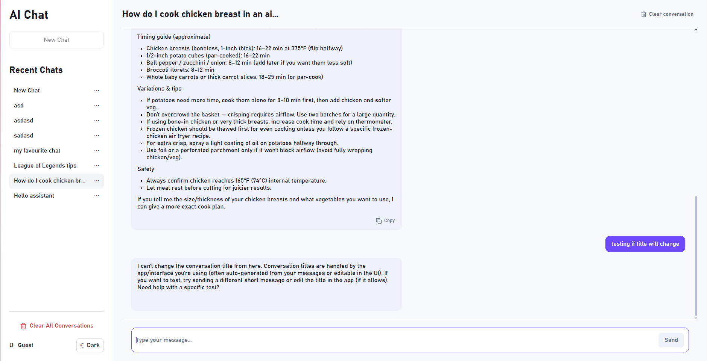
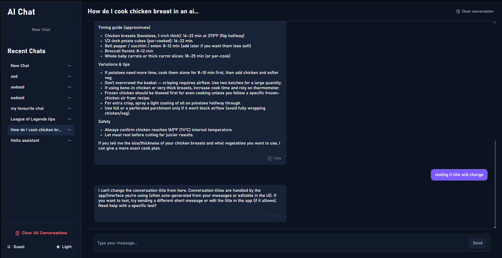

# AI Chat Application

A modern AI chat application built with **React**, **TypeScript**, and **Express** as part of the **Fivetran Front-End Engineer technical assignment**.

The application allows users to create and manage multiple AI conversations, interact with OpenAI's GPT-5 Mini model through a secure Express backend, and persist chat history locally between sessions.

---

# Features

### Chat Experience

- 💬 Multiple chat conversations
- 🤖 OpenAI GPT-5 Mini integration
- ⚡ Streaming AI responses
- 📝 Automatic conversation titles
- ✏️ Rename conversations
- 🗑️ Delete conversations
- 🧹 Clear individual conversations
- 🧹 Clear all conversations

### User Experience

- 💾 LocalStorage persistence
- 🌙 Light / Dark theme
- 📄 Markdown rendering
- 💻 Syntax-highlighted code blocks
- 📋 Copy assistant responses
- ⏳ Loading states
- ⚠️ Error handling
- 📱 Responsive layout

### Engineering

- 🔒 Secure Express backend proxy
- 🧪 Unit & integration tests
- ♿ Semantic HTML & accessibility considerations
- 🎯 Component-based architecture
- 📦 Type-safe development with TypeScript

---

# Highlights

This project demonstrates:

- Modern React development with Hooks
- Strong TypeScript usage throughout the application
- Component composition and separation of concerns
- Secure frontend-backend communication
- Responsive UI built with Sass (SCSS)
- Streaming API integration
- Persistent application state
- Modern testing using Vitest and React Testing Library

---

# Tech Stack

## Frontend

- React
- TypeScript
- Vite
- Sass (SCSS)
- React Markdown
- Remark GFM
- React Syntax Highlighter
- Lucide React

## Backend

- Express
- OpenAI Responses API
- dotenv
- cors

## Testing

- Vitest
- React Testing Library
- jsdom

---

# Design Decisions

## Express Backend

Instead of exposing the OpenAI API key to the browser, every AI request is routed through an Express backend acting as a secure proxy.

This approach keeps sensitive credentials private while providing a clean separation between frontend and backend responsibilities.

---

## Streaming Responses

Assistant responses are streamed from the backend to the frontend, allowing users to see answers appear progressively instead of waiting for the full response.

---

## LocalStorage Persistence

Conversations are automatically persisted in LocalStorage.

This allows chat history, theme preference, and conversation state to survive page refreshes without requiring authentication or a database.

---

## Component-Based Architecture

The application is divided into reusable React components with clearly defined responsibilities.

This keeps the codebase maintainable while making new features easier to implement.

---

## Markdown Rendering

Assistant responses support GitHub Flavored Markdown including:

- headings
- lists
- tables
- inline code
- fenced code blocks
- syntax highlighting

---

# Project Structure

```text
.
├── server
│   ├── src
│   └── package.json
│
├── src
│   ├── components
│   ├── layouts
│   ├── hooks
│   ├── services
│   ├── styles
│   ├── test
│   ├── types
│   └── utils
│
├── public
└── README.md
```

---

# Getting Started

## Prerequisites

Before running the project, install:

- Node.js (v20+ recommended)
- npm
- OpenAI API key

---

## 1. Clone the repository

```bash
git clone <repository-url>
```

---

## 2. Install frontend dependencies

```bash
npm install
```

---

## 3. Install backend dependencies

```bash
cd server
npm install
```

---

## 4. Configure environment variables

Create a `.env` file inside the `server` directory.

```env
OPENAI_API_KEY=your_openai_api_key
```

---

## 5. Start the backend

```bash
cd server
npm run dev
```

Runs on:

```
http://localhost:3001
```

---

## 6. Start the frontend

Open a second terminal:

```bash
npm run dev
```

Runs on:

```
http://localhost:5173
```

---

# Running Tests

Execute all tests:

```bash
npm test
```

---

# Screenshots

## Light Theme



---

## Dark Theme



---

## Markdown Rendering


---

## Mobile Layout


---

# Future Improvements

Potential future enhancements include:

- Conversation search
- Export conversations
- Authentication
- Cloud synchronization
- Docker support
- CI/CD pipeline with GitHub Actions
- Conversation folders
- Prompt templates
- Message editing & regeneration
